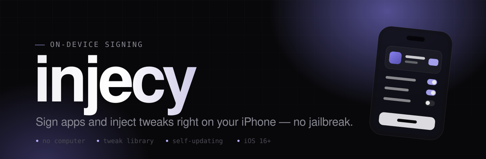

<div align="center">



<br>


[](https://github.com/w3ltyyy/injecy/stargazers)

**Sign IPAs and inject tweaks right on your iPhone — no jailbreak, no computer.**

[**Website**](https://leadproject.lol/injecy) · [Report a bug](../../issues/new) · [Request a feature](../../issues/new)

</div>

---

**injecy** is an on-device iOS app for **signing apps and injecting tweaks**. Sign IPAs
with your own certificate, browse a tweak library or import your own `.dylib` / `.deb`,
and let the app keep itself up to date — all on the device, nothing sensitive leaves it.

It's a fork of [**Feather**](https://github.com/khcrysalis/Feather), licensed under the
**GNU GPL v3**.

> [!NOTE]
> **This repository is the iOS client only.** The backend it talks to
> (`api.leadproject.lol`) is a separate, closed-source service. To run injecy against
> your own server, point `InjecyBackend.base` at it and set your client secret in
> `Secrets.swift` — see [Building](#-building).

<br>

## ✨ Features

|  | |
|---|---|
| 🖊️ **Sign & install** | Sign IPAs and install them on-device — Server or IDevice install. |
| 🧩 **Tweak library** | Browse tweaks or import your own `.dylib` / `.deb`. |
| ♻️ **Self-updating** | Updates itself, re-signed with your certificate — no re-sideloading. |
| 🔐 **Private by design** | Certificates stay on the device. No account, no tracking. |
| 🍏 **iOS & macOS** | Universal build — runs on iPhone, iPad and macOS (Catalyst). |
| 📲 **Web install** | Install straight from the [website](https://leadproject.lol/injecy) by uploading your certificate. |

<br>

## 🚀 Install

The easiest way is the **[website](https://leadproject.lol/injecy)** — upload your
certificate and injecy installs over the air. You can also grab the IPA from
[Releases](../../releases) and sideload it with your favourite tool (Sideloadly,
AltStore, …). A valid signing certificate (`.p12` + `.mobileprovision` for your device)
is required.

<br>

## 🛠 Building

**Requirements** — Xcode 26+, [XcodeGen](https://github.com/yonaskolb/XcodeGen)
(`brew install xcodegen`) and [`jq`](https://stedolan.github.io/jq/).

```sh
# 1 · Clone
git clone https://github.com/w3ltyyy/injecy.git
cd injecy

# 2 · Provide build-time secrets
cp injecy/Backend/Observable/Secrets.swift.example injecy/Backend/Observable/Secrets.swift
#    → edit Secrets.swift and set your backend client secret

# 3 · Provide the on-device HTTPS server pack   (see deps/README.md)
#    → drop cert.json into deps/, or let the app fetch it at runtime

# 4 · Generate the Xcode project and open it
xcodegen generate
open injecy.xcodeproj
```

<details>
<summary><b>Notes &amp; gotchas</b></summary>

<br>

- `injecy.xcodeproj` is generated from [`project.yml`](project.yml) and is **not**
  committed — run `xcodegen generate` after cloning or editing `project.yml`.
- **Version pins matter:** `SWCompression` is pinned to `4.8.6` and `BitByteData` to
  `2.0.4`. Newer releases raise the minimum iOS version and break the iOS 16 target.
- `AltSign` (in `Packages/`) is vendored and must be **embedded + code-signed** — already
  configured in `project.yml`; it crashes at launch otherwise.
- The Live Activity **widget is disabled** in the default build — an app extension needs
  its own provisioning that most (non-wildcard) certificates can't supply. See the
  comment in `project.yml` to re-enable it.
- The on-device install server needs a localhost-valid TLS cert (the community
  `*.backloop.dev` pack) — details in [`deps/README.md`](deps/README.md).

</details>

<br>

## 🔒 Security

Everything sensitive lives on the server, not in this client — see
[`SECURITY.md`](SECURITY.md) for the model and how to report a vulnerability. Real
secrets (`Secrets.swift`, the server-pack private key) are git-ignored and never
committed.

<br>

## 🙌 Credits

Built on [**Feather**](https://github.com/khcrysalis/Feather) by khcrysalis and
contributors. Uses [Zsign](https://github.com/zhlynn/zsign),
[AltSign](https://github.com/SideStore/AltSign) and the SideStore/AltStore
`*.backloop.dev` server pack. Thank you to everyone in the sideloading community. 💜

<br>

## 📄 License

[**GNU General Public License v3.0**](LICENSE). Because injecy is derived from Feather
(GPLv3), it stays GPLv3 — no additional restrictions may be added, and any distributed
build must offer its source under the same terms.

<div align="center"><br><sub>injecy — by <a href="https://leadproject.lol">lead</a></sub></div>
